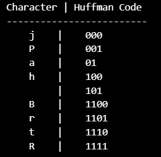

# Huffman-Coding
## Aim
To implement Huffman coding to compress the data using Python.

## Software Required
1. Anaconda - Python 3.7

## Algorithm:
### Step1:
Get the input string.

### Step2:
Create tree nodes.

### Step3:
Main function to implement huffman coding.

### Step4:
calculate frequency of occurence.

### Step5:
print the characters and its huffmancode.
 
## Program:

``` Python
#NAME : Bharath Raj P
#REG :  212223230031

input_string = "Bharath Raj P" 

frequency = {}
for char in input_string:
    if char in frequency:
        frequency[char] += 1
    else:
        frequency[char] = 1

nodes = [[char, freq] for char, freq in frequency.items()]

while len(nodes) > 1:
    nodes = sorted(nodes, key=lambda x: x[1])
    left = nodes.pop(0)
    right = nodes.pop(0)


    new_node = [[left, right], left[1] + right[1]]
    nodes.append(new_node)

huffman_tree = nodes[0]
huffman_codes = {}

def generate_codes(tree, code=""):
    if isinstance(tree[0], str): 
        huffman_codes[tree[0]] = code
    else:
        generate_codes(tree[0][0], code + "0")
        generate_codes(tree[0][1], code + "1")

generate_codes(huffman_tree)
print("Character | Huffman Code")
print("-------------------------")
for char, code in huffman_codes.items():
    print(f"    {char}    |    {code}")
```
## Output:

### Print the characters and its huffmancode


## Result
Thus the huffman coding was implemented to compress the data using python programming.